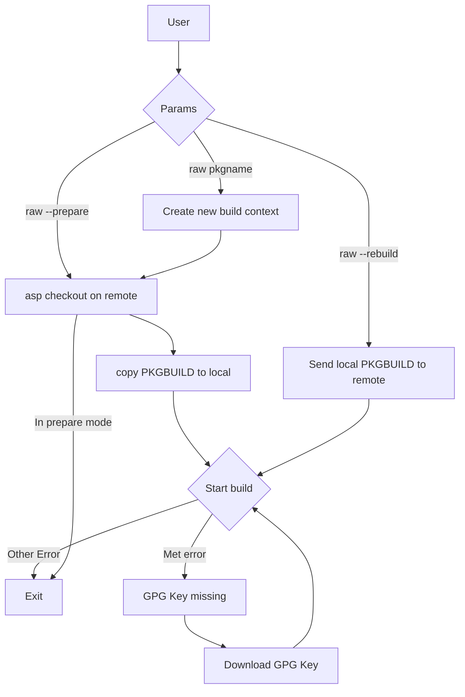

# RAW (RISC-V Archbuild Wrapper)

- Install:

```bash
curl -sL 'https://raw.githubusercontent.com/Avimitin/riscv-archbuild-wrapper/master/raw' -o ./raw
```

- Usage:

```bash
# Create a directory at current directory, then put all the file inside of it
./raw <PKG>

# Send the local PKGBUILD to remote, and rerun the build
./raw --rebuild <PKG>

# Download PKGBUILD at local, then exit.
# Useful for fixing rotten package when using it with --rebuild.
./raw --prepare <PKG>

# Specify a server to run the script
./raw --server <SERVER> <PKG>

# Run server test only. It will overwrite the local test result buffer.
./raw --update-server
```

## TODO

- [ ] Add download source
- [x] Add context - json dumper
- [ ] Document
- [ ] Smoking test
- [ ] Manage Multiple project
- [x] Add GPG Key auto download

## My workflow

- Failing package

```bash
# Create a workspace
mkdir -p $HOME/riscv/packages
cd $HOME/riscv/packages
curl -sL 'https://raw.githubusercontent.com/Avimitin/riscv-archbuild-wrapper/master/raw' -o ./raw

# Assuming that I am going to fix iana-etc

# First try
./raw iana-etc

# If fail
ls -a $HOME/riscv/packages/iana-etc

# output
# .ctx.json PKGBUILD raw build.log prepare.log ...

# If I need to modify source code
./raw --download-source iana-etc

ls -a $HOME/riscv/packages/iana-etc

# output
# Same as above, but we have a new directory for the source code
# ...... src/


# After fix
./raw --send a.patch b.patch c.patch iana-etc
./raw --rebuild iana-etc
```

- Rotten package

```bash
# if the remote and local doesn't download PKGBUILD file yet
./raw iana-etc --prepare

cp archriscv-packages/iana-etc/riscv64.patch ./iana-etc/
patch -d ./iana-etc -Ni riscv64.patch

./raw iana-etc --rebuild
```

## Design



- The possible multiple project management

```text
~/riscv/packages/
  |- raw
  |- package-a/
      |- src/
        |- ...source code...
      |- PKGBUILD
      |- .ctx.json
      |- packageA-ver-rel-build.log
      |- fix.patch
  |- package-b/
      |- src/
        |- ...source code...
      |- PKGBUILD
      |- .ctx.json
      |- packageB-ver-rel-check.log
```
