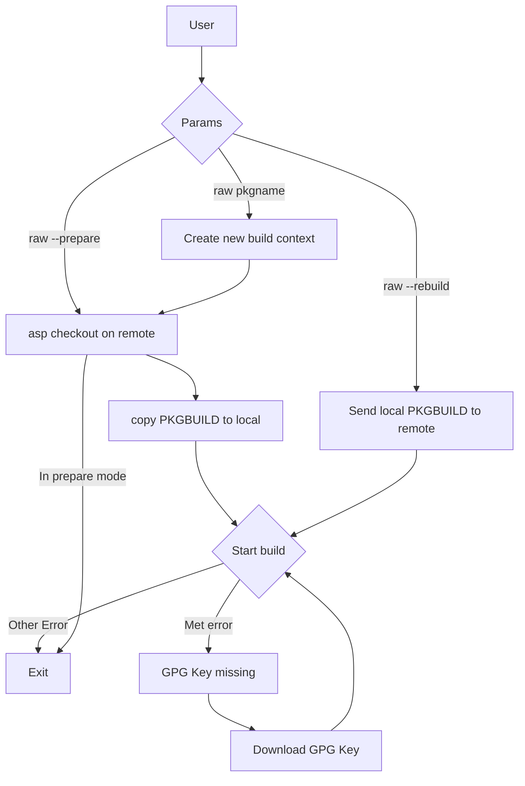

# RAW (RISC-V Archbuild Wrapper)

- Install:

```bash
curl -sL 'https://raw.githubusercontent.com/Avimitin/riscv-archbuild-wrapper/master/raw' -o ./raw
```

- Usage:

```bash
# Run server test, then run the asp checkout and extra-riscv64-build
./raw <PKG>

# Send the local PKGBUILD to remote, and rerun the build
./raw --rebuild <PKG>

# Download PKGBUILD at local, then exit.
# Useful for fixing rotten package when using it with --rebuild.
./raw --prepare <PKG>

# Specify a server to run the script
./raw --server <SERVER> <PKG>

# Run server test only. It will overwrite the local test result buffer.
./raw --update-server
```

## TODO

- [ ] Add download source
- [ ] Add context - json dumper
- [ ] Document
- [ ] Smoking test
- [x] Add GPG Key auto download

## My workflow

- Failing package

```bash
# Preparing
mkdir -p $HOME/riscv/packages
cd $HOME/riscv/packages
# Assuming that I am going to fix iana-etc
mkdir iana-etc
cd iana-etc
curl -sL 'https://raw.githubusercontent.com/Avimitin/riscv-archbuild-wrapper/master/raw' -o ./raw

# First try
./raw iana-etc

# If fail
ls -a
# output
# .ctx.json PKGBUILD raw build.log prepare.log ...

# If I need to modify source code
./raw --download-source
ls -a
# output
# .ctx.json PKGBUILD raw build.log prepare.log iana-etc-src/ ...


# After fix
./raw --send a.patch b.patch c.patch
./raw --rebuild
```

- Rotten package

```bash
mkdir iana-etc
cd iana-etc

# if the remote and local doesn't download PKGBUILD file yet
./raw iana-etc --prepare

cp archriscv-packages/iana-etc/riscv64.patch .
patch -Ni riscv64.patch

./raw iana-etc --rebuild
```

## Design


